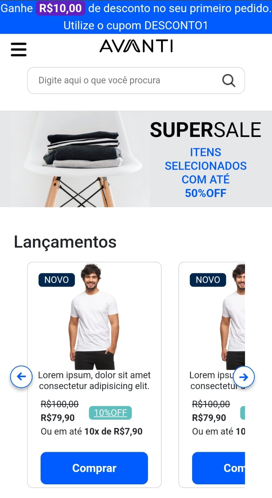

# Loja E-commerce Avanti

## Descrição do Projeto  

Loja de E-commerce de roupas e acessórios da Avanti

# Front-end:

## As Tecnologias utilizadas

- **Javascript**: linguagem de programação.

- **HTML**: Linguagem de hipertexto para estruturação.
  
-  **CSS**: Estilização da página

- **Bootstrap**:  framework de código aberto e gratuito para desenvolvimento web para trabalhar com responosividade.

## Imagens da aplicação Web e Mobile

<h3 align="center">Versão Web</h3>

  

<h3 align="center">Versão Mobile</h3>

  

  
